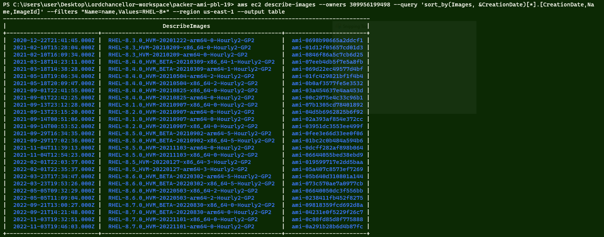
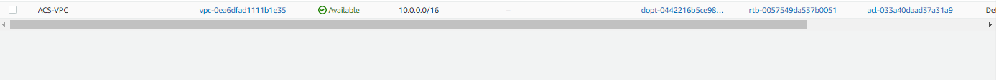
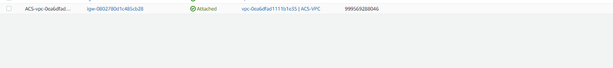
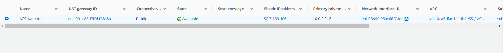
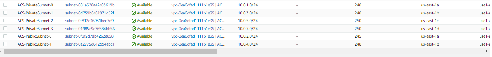
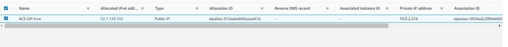
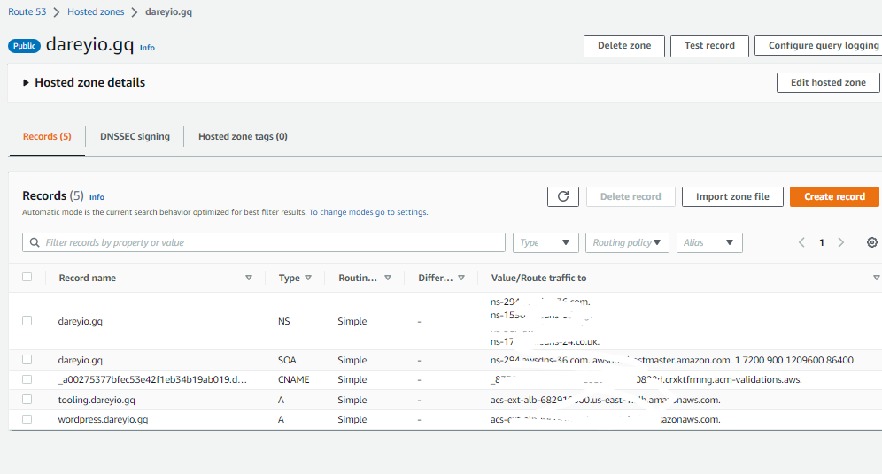
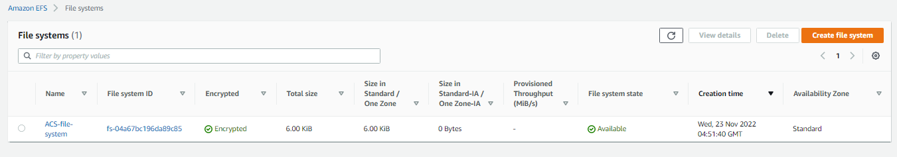
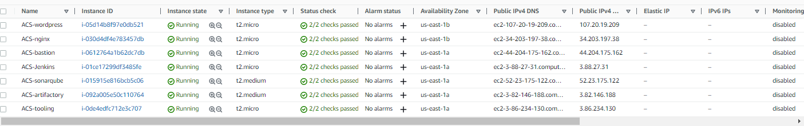
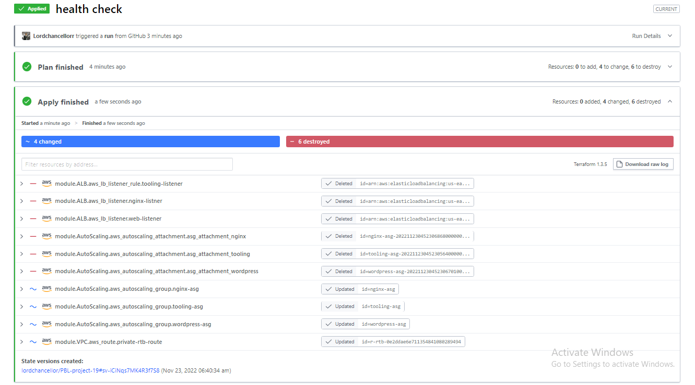

## Documentation of Project 19
---

**Automate infrastructure with iac using terraform. part 4 – Terraform Cloud**
-

In previous projects (17-18), we have deployed infrastructures and deployed them manually from our local machine through the terminal with the aim of launching two websites(Tooling and Wordpress respectively). We could deploys the infrastrucrures successfully but the websites were not up and running because we needed to update the mounting endpoints and update the database which we could not do due to the automatic deployment of all the infrastructures. However, this project is the completion of what we have started. Remember we introduced the use of Modules and essential use of variables to reduce hardcoding, this time we will be deploying the infrastructures from three different softwares in other to suceessfully launch the websites. WEe will be making use of packer, ansible and terrsform cloud. We will be managing three different repositories. One will be to generate the AMIs(**Packer**), then **Terraform Cloud** will be used to deploy infrastructures on AWS console while **Ansible** will be used to update the mount points and databased respectively. Please kindly follow keenly.

In this project, i installed packer into my local machine using **CHOCOLATEY** afterw which i confirmed the installation and extracted the AMIs needed for the infrastructures i intend to launch. After creating AMIs and deploying it on AWS, the images below were the results.

After extracting the AMIs, i created an account on Terraform cloud, connected my Github account so i could run deploy all other infrastructures since i already updated the AMIs in the `terraform file` with the newly generated AMIs. After connecting my Github account with Terraform cloud, i created a workspace and imported my Terraform folder into the cloud. wHen i pushed the new changes made on the terraform folder from my local machine using vs code to my github account, terraform plan immediately kick and i confirmed all the expected infrastructures were carefully planned before i applied it. (I had to do alot of trouble shooting before because terraform kept returning errors). Please note that i manually added my Secret and Access Key on Terraform Cloud so it could access my aws console. After the required setup, applied and 87 infrastructures were successfully deployed and i confirmed it on my console. Check the images below:

After a successful deployment, it was time to run the ansible playbook since we now have the required efs moutnt points an database. To do this do, i logged to the bastion server using ssh(i had to troubleshoot this thoroughly as it gave me a lof of issues). After logging into to my bastion server, i cloned down the ansible repository from gitlab, updated the efs mount points and database details respectively. Before i did this, after i deployed the above infrastructures on aws, i checked the health status of the target groups and they were all unhealthy so i commented the listerners and target groups health status out from the `alb`, `webserver` and `autoscaling` files before running the ansible playbook command. After that, i ssh into the wordpress and tooling servers to confirm status of httpd and whether the correct folders and files. 

I checked the health status of all the target groups and they were all healthy. I had to manually update the `config.php` file in the wordpress server, and manually restart nginx before confirming if the websites were launched successfully. 

I then accessed the websites from my browser and it worked. I was able to access the wordpress, tooling and jenkins seamlessly. I even tried to navigate through the wordpress web page and yeah! It was fun. Check the images below:

This brings us to the conclusion of this project. Thank you.